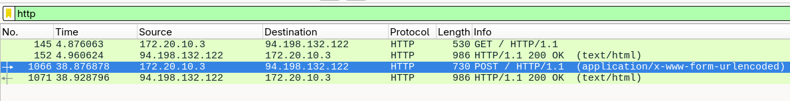
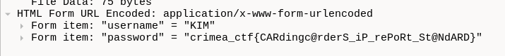

# Wireshark

Task from reverse engineering category with forgotten name.

## Input

[Pcap file](../Payloads/task.tar.gz).

## Goal

Find flag in the pcap file.

## Solution

Open the file in Wireshark, use the default http filter.



Check contents of filtered queries.



Guess what's there?

## The flag

```text
crimea_ctf{CARdingc@rderS_iP_rePoRt_St@NdARD}
```
