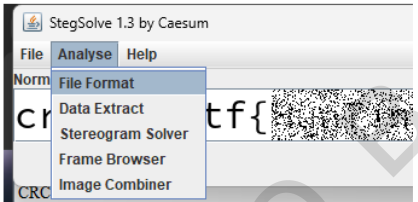
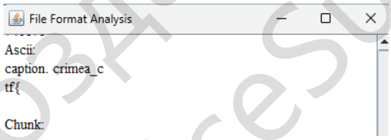
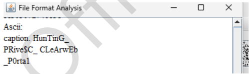

# 8Bit (Steganography)

*Challenge*: Extract the flag from multiple similar-looking images.

## Solution
We open first image in StegSolve. Then open "Analyze > File format".



There we will get the first flag.



We do the same with second image.



Now we have 2 chunks of flag that we need to merge and submit.

## The flag
```text
crimea_ctf{HunTinG_PRive$C_CLeArwEb_P0rta1}
```
