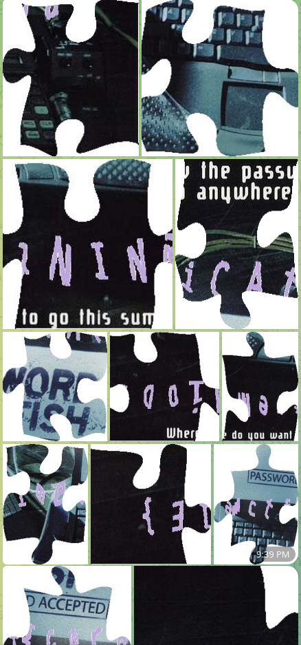

# Puzzle (Steganography)

Task from steganography category with forgotten name.

## Input

We were presented with a set of image fragments that together formed a puzzle with the flag visually drawn across the assembled pieces.

All images can be found in the [archive](../Payloads/puzzle_all.zip).

## Challenge Objective

Reconstruct the complete puzzle image from all fragments to reveal and read the flag.

## Solution

Our first instinct was to use Adobe Photoshop to assemble the puzzle, but:
- No team members had Photoshop installed
- With our poor Wi-Fi connection, downloading Photoshop would have taken over an hour

We then considered using GIMP because:
- Our team primarily uses GNU/Linux systems
- We hoped someone might already have GIMP installed

Unfortunately, no one had it ready to use. The GIMP installation took approximately 20 minutes.

After installing the GIMP, we collected a puzzle in 5 minutes. Now we can read the flag, but it was so difficult to read the font that was used in the image that we spent about 30 minutes to guess the characters that were not obvious.

## The flag

Having gone through this tedious process once, I have no intention of reassembling this particular puzzle again. If you're interested in seeing the complete flag, you'll need to download the pieces and assemble them yourself!
